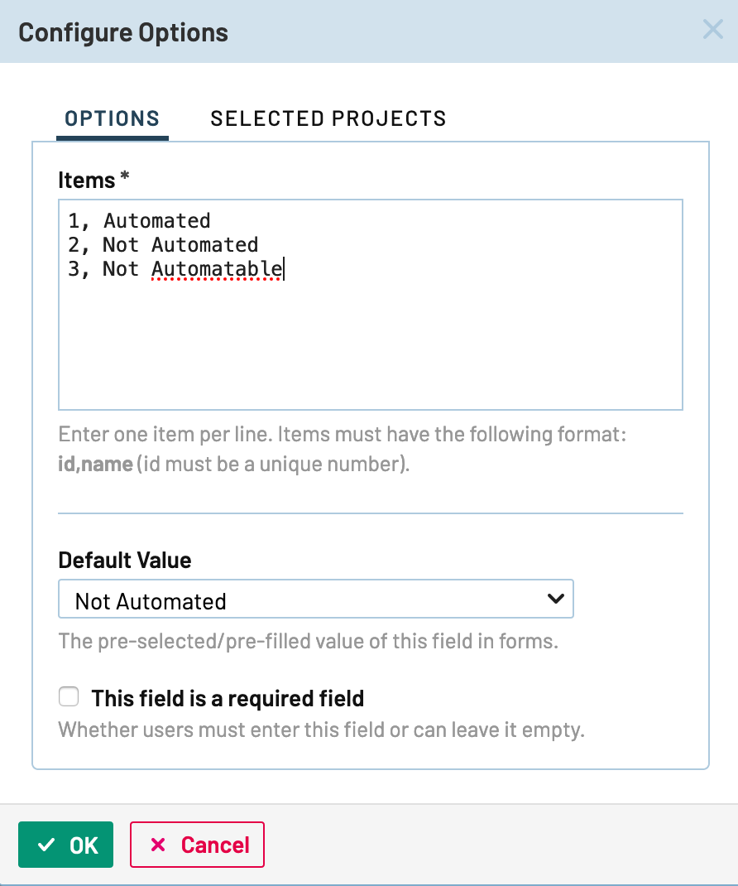
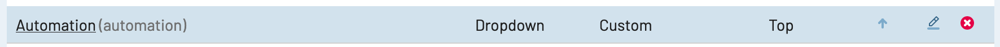
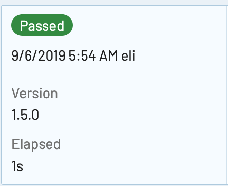

# TestRail Listener
This is a test listener specifically designed to work with TestRail, and a test automation framework using Java, TestNG and maven. It is designed to automatically: 

* Update test status (PASSED, FAILED, etc)
* Provide the version of the application under tests
* Provide the elapsed run time of the test
* Set status of automated tests to AUTOMATED
* Create a test run of all test cases or only the automated ones - Configurable
* Close the created test run - Configurable

In order to use this listener properly some minor customization needs to be done to the instance of TestRail running

## Getting Started
### TestRail Customization Setup
1. Click on `Administration` > `Customizations`
2. Under `Case Fields` click `Add Field`
3. Set Label value to be: `Automation`
4. Set System Name to be: `automation`
5. Set Type to be: `Dropdown`
6. On the bottom click `Add Projects & Options`
7. Set the following values:

8. Click OK
9. Under `Case Fields` the following should not be visible:


### Building the listener
After cloning the project out run:

`mvn clean install`

this will deploy the built jar file `testrailListener-1.0.jar` to your local `~/.m2` directory.

## Setting up project to utilize the listener
### pom.xml file
Within the pom.xml file add the following dependency:

```
<dependency>
	<groupId>com.project.test.testrailListener</groupId>
	<artifactId>testrailListener</artifactId>
	<version>1.0</version>
</dependency>
```

### testng.xml file
Within the testng.xml file add the following listener:

```
<listeners>
		<listener class-name="com.project.test.testrailintegration.TestRailListener"/>
</listeners>
```

### Adding configuration files
Within the `src/test/resources` directory create 2 properties files:

#### TestRailCommon.properties
This properties file allows the listner to communication with the given deployed instance of TestRail. Add a `TestRailCommon.properties` with the following keys and values mapping to the specific testrail deployment:

```
Protocol=
Host=
Port=
Path=
ApiPath=
TestCases.IncludeAll=
TestRuns.Close=
```

For example:

```
Protocol=http
Host=localhost
Port=8000
Path=index.php
ApiPath=/api/v2/
TestCases.IncludeAll=true
TestRuns.Close=false
```

#### TestRailListener.properties
This properties file allows the listner to communicate with the respective project - ultimatly where it would expect test case IDs for the test scenarios that are automated to reside in. Add a `TestRailListener.properties` with the following keys and values mapping to the respective user, api key, and project id:

```
TestRail.User.Email=
TestRail.User.APIKEY=
TestRail.ProjectID=
```
For example:
```
TestRail.User.Email=testuser@email.com
TestRail.User.APIKEY={apiKeyForUser}
TestRail.ProjectID=1
```

## Setting up the test classes/methods to utilize the listener
In order for the listener to be able to know which test cases are automated, it will depend on the test case id. This listener supports test case ids that are specified in either the **class name** or in the **test method**. The class name or test method name must start with the test case id, followed by an underscore `_`.

For example when specifying the test case id within the class name it would be:

```java
public class C1234_VerifyScenario {

}
```

When specifying the test case id within the test method name it would be:

```java
public class VerifyManyScenarios {
	@Test
	public void C1234_TestScenario1() {
	
	}
	
	@Test
	public void C4567_TestScenario2() {
	
	}
}
```
### Initializing a call to set the version
One of the features of the listener is that it allows you to set the version of the application you are testing so that it appears in the name of the test run

as well as the results of the test.


In order to utilize this feature, the very first test that is ran must make a call to the following static method and set the version.

```java
TestRailListener.setApplicationVersion("1.5.0");
```
it is highly recommended to give this special version test a group name and have all subsequent tests depend on this test using testng's `dependsOnGroups` .

If a call is not made to that method, your version will automatically be set to 0.0.0 and would appear as such in the test run:


